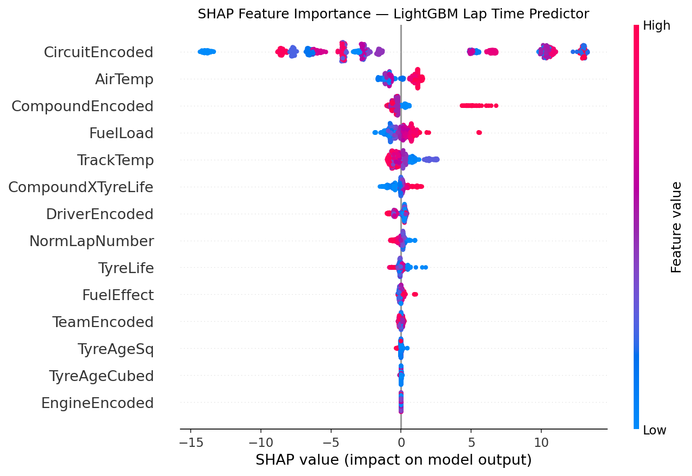
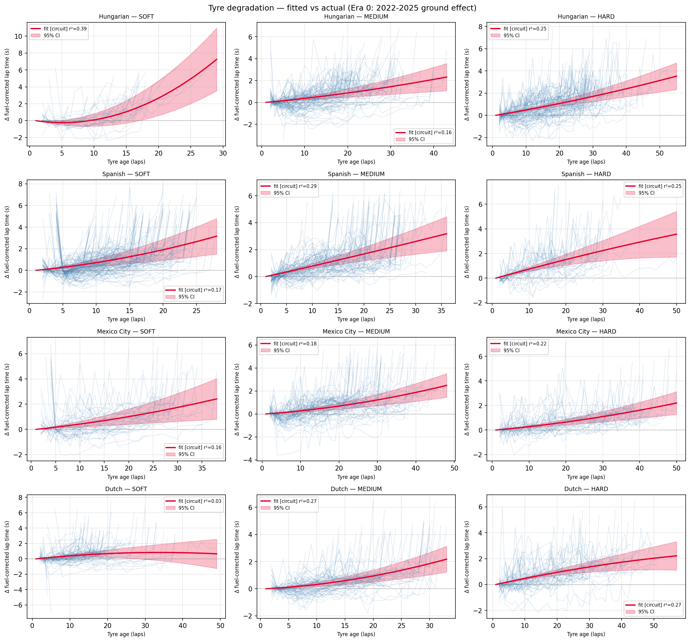

# 🏎️ F1 AI Race Strategist

**An AI system that predicts F1 lap times across regulation eras with a Temporal Fusion Transformer, models tyre degradation with physics-informed curves, and composes both — *with their uncertainties* — into a Monte Carlo race-simulation engine that recommends pit strategy as win-probability distributions.**

Most F1 ML projects stop at "I trained a model on a table." This project composes uncertainty-aware models into a simulation engine that outputs **probability distributions over strategies, not point estimates** — which is what real motorsport strategy teams actually do.

> **Status:** lap-time models (ladder + TFT, conformally recalibrated), tyre degradation curves, pit-strategy MDP, and the Monte Carlo simulation engine are complete and validated against historical races. Next: RL stretch + dashboard. See [roadmap](#roadmap).

---

## Headline results

**Lap-time MAE (seconds), season-aware splits — train 2022–24, val 2025, test 2026:**

| Model | Val all / green (2025, era 0) | Test all / green (2026, era 1) |
|---|---|---|
| BayesianRidge (one-hot + scaled) | 4.35 / 3.13 | 4.19 / 3.09 |
| RandomForest (integer codes) | 6.47 / 5.63 | 8.87 / 8.30 |
| LightGBM (Optuna-tuned baseline) | 3.49 / 2.14 | 3.53 / 2.22 |
| **Temporal Fusion Transformer (swept)** | **2.27 / 1.02** | **3.77 / 1.56** |

Three results worth reading closely:

1. **The TFT roughly halves the LightGBM green-flag MAE on both splits.** Its edge is legitimate sequence modeling, not leakage: the encoder consumes each stint's *past lap times* (known at prediction time) to predict the next lap — degradation dynamics a tree treating laps as independent rows cannot see.
2. **Cross-regulation generalization.** 2026 introduced new aero/power-unit regulations and three new teams (test set = unseen era, 6 races). LightGBM holds 2.16 → 2.11 green MAE across the boundary; the TFT holds 1.02 → 1.56. Era is an explicit feature, encodings are frozen from train, and the degradation across the boundary is reported, not hidden.
3. **RandomForest is kept as a documented failure case.** It collapses across the era boundary (5.61 → 8.52) because it can't handle integer-coded categoricals or unseen teams — the motivating contrast for LightGBM's native categorical handling. Honest baselines beat quiet deletions.

**Uncertainty is a first-class output — and it's recalibrated.** The TFT predicts 0.1/0.5/0.9 quantiles; raw coverage is 0.72 in-era / 0.67 across the 2026 boundary vs 0.80 nominal (overconfident — a sharper median means narrower raw bands). Era-aware **split-conformal recalibration** (calibrated on held-out rounds, never the laps it's scored on) fixes it: era-0 coverage **0.787**, era-1 **0.813** — both inside the success window, with shifts of just +0.05s/+0.15s (the swept model generalizes well enough that conformal is a trim, not a rescue). The simulation engine samples from the *recalibrated* bands.

**Strategy layer (Phase 4):** an exact backward-induction **MDP** (lap × tyre-age × compound × two-compound-rule) proposes strategies; the **Monte Carlo engine** (vectorized torch rollouts of the full field with tyre/pace/pit-loss uncertainty + a circuit-class overtaking model) ranks them as win-probability distributions. They agree independently — the MDP's optimal Bahrain 2-stop also wins the sim's recommendation table. **Validated by historical replay**: across 4 contrasting 2025 races, 81% of drivers' actual finishing positions fall inside their central-80% simulated band (target 80%; the residual miss is SC-affected Bahrain — the v1 engine has no safety-car model, documented).

**Tyre degradation (Phase 3):** quadratic curves `b·age + c·age²` fit per (compound × circuit × era) on fuel-corrected, green-flag-only stint deltas, with 95% CIs from the covariance and hierarchical pooling for thin cells (2026 cells pool to era level — wide CIs in low-data regimes, never false precision). Era-0 degradation rates land in physically sensible territory: HARD 0.024 / MEDIUM 0.033 s/lap linear terms, SOFT carrying the largest cliff coefficient.

<p align="center">
  
  
</p>

---

## Architecture

```
FastF1 (2022–2026 race laps, cached)
        │
   ingest → validate (Pandera) → features → season splits (no shuffle, frozen encodings)
        │
        ├── Baseline ladder: Ridge → RF → LightGBM (Optuna)     [models to beat]
        ├── TFT (pytorch-forecasting): stint sequences,          [headline model]
        │        quantile uncertainty, cross-era evaluation
        └── Tyre curves: curve_fit per compound×circuit×era,     [physics-informed]
                 hierarchical pooling, 95% CIs
        │
        ▼
   Pit-strategy MDP (proposes) ──► Monte Carlo engine (disposes)  ◄── THE SHOWCASE
   composes lap-time + tyre + pit-loss models WITH (recalibrated) uncertainty
   N ≥ 1000 vectorized rollouts → strategy win-probability distributions
   validated by historical replay (79% coverage vs 80% target)
        │
        ▼
   (RL stretch) → FastAPI → Streamlit dashboard
```

## Evaluation discipline

- **Season-aware temporal splits only** — shuffled splits would leak across regulation changes and overestimate accuracy massively.
- **Per-circuit and per-era MAE always** — aggregates hide failures (the TFT is excellent at Suzuka, 0.46s green; poor at street circuits, ~3s at Canada — reported, and the sim will treat street circuits as higher-variance).
- **Green-flag vs all-laps split** — safety cars are not predictable from pre-lap features; the gap is quantified instead of polluting the headline.
- **Calibration measured** for every uncertainty estimate.
- **Frozen mappings** — circuit/team encodings built from train only; unseen teams (Audi, Cadillac…) hit a −1 sentinel, the same path a brand-new team takes at serving time.
- Every model card lives in [`src/models/model_cards/`](src/models/model_cards/).

## Repo map

```
src/pipeline/             ingest, validate, features, splits  (column contracts = law)
src/models/lap_time/      train.py (ladder), train_tft.py, evaluate.py, recalibrate.py
src/models/tyre/          fit.py (degradation curves + pooling)
src/models/pit_strategy/  pit_loss.py (measured), mdp.py (exact backward induction)
src/simulation/           engine.py (Monte Carlo showcase), validate_sim.py (replay)
src/models/model_cards/   honest model cards with real numbers
reports/                  per-circuit / per-era / calibration / validation CSVs + plots
tests/                    71 unit tests
notebooks/                EDA + Kaggle GPU training notebooks (04 = TFT v1, 05 = v2)
```

## Reproduce

```bash
python -m venv venv && venv/Scripts/activate     # Python 3.13
pip install fastf1 pandas pandera scikit-learn scipy mlflow shap matplotlib \
            joblib pytest lightgbm optuna                       # core CPU deps
python -m src.pipeline.ingest                    # fetch FastF1 data (cached)
python -m src.models.lap_time.train              # ladder + Optuna → MLflow
python -m src.models.lap_time.evaluate           # all report CSVs/plots
python -m src.models.lap_time.recalibrate        # conformal shifts (needs tft_lap.ckpt)
python -m src.models.tyre.fit                    # degradation curves
python -m src.models.pit_strategy.pit_loss       # measured pit-loss table
python -m src.models.pit_strategy.mdp            # optimal strategies + heatmaps
python -m src.simulation.validate_sim            # historical replay validation
pytest -q                                        # 71 tests
```

The TFT trains on GPU (`notebooks/04_tft_kaggle_fullrun.ipynb`, Kaggle T4 — pinned `pytorch-forecasting==1.7.0` / `lightning==2.6.5` / torch cu128; P100 unsupported by the cu128 wheel).

## Known limitations (read before trusting any number)

No live telemetry (tyre temps, fuel flow, ERS, active-aero state — the last especially impactful in 2026). Fuel load is a linear estimate. SOFT/MEDIUM/HARD labels hide circuit-varying C1–C5 compounds. The 2026 test set is six races and statistically noisy. TFT intervals are overconfident across the era boundary (measured, documented, recalibration planned). The simulation's outputs will inherit every one of these.

## Roadmap

- [x] Data pipeline + validation + leakage-proof splits (2022–2026)
- [x] Baseline ladder: Ridge → RF → LightGBM (Optuna), SHAP, ablations, model card
- [x] TFT with quantile uncertainty, cross-era eval, calibration measurement
- [x] Tyre degradation curves with CIs + hierarchical pooling
- [x] TFT quantile recalibration (era-aware split conformal — coverage 0.787/0.813 vs 0.80 nominal)
- [x] Pit-strategy MDP (exact backward induction, two-compound rule, policy heatmaps)
- [x] **Monte Carlo race-simulation engine** — 81% historical-replay coverage vs 80% target
- [x] **TFT hyperparameter sweep (2 rounds on Kaggle T4) — v3 deployed.** Round 1 confirmed the hand-picked v1 config near-optimal *for v1 features* (best alternative tied at +0.004s), but exposed that the earlier "v2 features failed" result was an undertraining + capacity artifact: converged at hidden 64, `Driver`+`EngineMaker` static categoricals win. Round 2 settled the architecture (h96/h128 overfit, encoder 24 < 12) → **val green 1.12→1.02, test green 1.62→1.56 — the cross-era driver-as-proxy cost did not materialize at convergence.** Selection val-only throughout; sweep records in `reports/lap_time/hpo_*.csv`.
- [ ] RL pit agent vs MDP in the simulator (stretch)
- [ ] FastAPI + Streamlit dashboard + deployment
